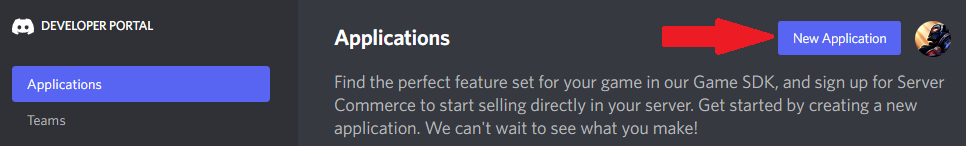
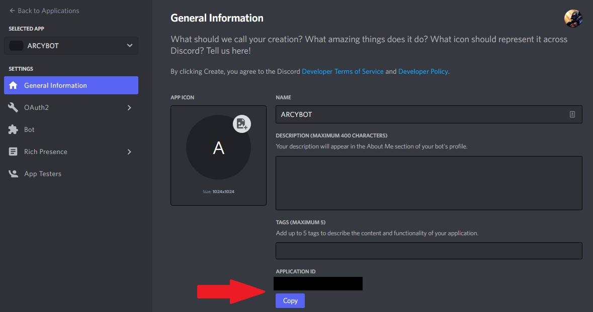

# Connect bot to Discord

We start from creating a Discord application. This way we will get a **Discord token** and the **bot's application ID**, which are necessary for the bot's development.

## Create a Discord app

Navigate to [Discord Developer](https://discord.com/developers/applications) portal. Click the "New application" button in the top right corner. You will be prompted to enter the name of your new application. Call it something nice (◡‿◡✿)




After confirming application's name you will be redirected to its page. For now, it's just an ordinary Discord application - what we need is to add a bot user to it, so it can interact with Discord's client.

## Setup a bot user

Navigate to the `Bot` tab on the left sidebar. Once you're there, click the `Add bot` button on the right. When asked if you want to add a bot to the app, confirm.

You will be redirected to your bot's page. Here you can set its username and avatar, as well as more advanced configuration related to permissions and authorization.

### Get the bot's token

For the bot to work, you will need its token. On the right side of the bot's avatar you will see a `Reset token` button. Clicking it will regenerate your bot's Discord token and show it to you once.

Save this token somewhere safe - we will need it later.

:::tip
If you ever lose your token, you can go back to this page and reset token again.
:::
:::danger
***Never expose your bot's token.*** It's a violation of Discord's ToS and will open your bot to hackers, what can be devastating to every server it's in if it has elevated permissions.
:::

### Privileged gateway intent

If you want your bot to receive information about events from the Discord (for example someone starting a stream, user leaving a server, editing their message etc.) you will need to toggle on necessary intents.

- **presence intent** - user changing their status, user starting/stopping stream, user playing a game, user listening to music etc.
- **server members intent** - user joining or leaving a server, user getting kicked, user getting banned etc.
- **message content intent** - user sending, editing or deleting a message

### Bot permissions

If you know your bot will need particular permissions to work, you can set them in the section at the bottom of the page and append them to its invite link - then whenever it joins a server, it will have its own role created with all the permissions being given automatically.

After setting your bot's permissions, copy the permissions integer at the bottom and save it somewhere - we will need it in the next section.

## Invite the bot to your server

Navigate to the `General Information` tab and copy the bot's Application ID:



Now it's time to generate your bot's invitation link:

```
https://discord.com/oauth2/authorize?client_id=CLIENT_ID&scope=bot&permissions=PERMISSIONS
```

Replace `CLIENT_ID` with the application ID you just copied, and `PERMISSIONS` with the permission integer you generated in the last step.

That's it - now you can use that link to add the bot to your server, where you will be able to test it!
