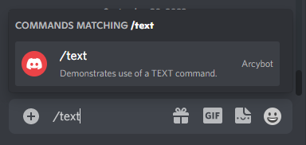

# Text command

Text command is the simplest command type. After being used it just returns a string.

### Text command object

```ts
type TextCommand = {
  /**********************
   * TEXT COMMAND PROPS *
   * ********************/

  type: CommandType.TEXT, // indicated that the command is of a TEXT type
  text: string,           // the string that commands return upon being called
  
  /*************************
   * GENERIC COMMAND PROPS *
   * ***********************/
  
  keyword: string,        // keyword to use the command
  description: string,    // description of the command appearing in the slash command menu
  isDisabled: boolean,    // if set to true, command cannot be used
  isModOnly: boolean,     // if set to true, only users with ADMIN permissions can use it
  canUseInDm: boolean,    // if set to true, it can be used in private message
}
```

### Example

```ts title="index.ts"
import Arcybot, { CommandObject } from 'arcybot';

const commandsObject: CommandObject[] = [{
  type: CommandType.TEXT,
  keyword: 'text',
  text: 'I am a text command!',

  description: 'Demonstrates use of a TEXT command.',
  isDisabled: false,
  isModOnly: false,
  canUseInDm: true,
}];

const bot = new Arcybot(commandsObject, [], CONFIG);

bot.start();
```




