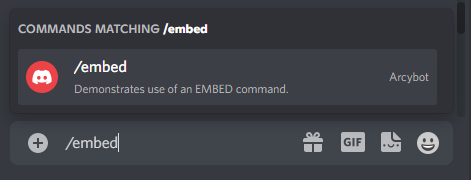
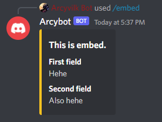

# Embed command

Embed command allows you to create simple embeds and send them as a message. Currently the only embed field type supported is `string`.

### Embed command object

```ts
type EmbedCommand = {
  /***********************
   * EMBED COMMAND PROPS *
   * *********************/

  type: CommandType.EMBED,  // indicated that the command is of an EMBED type
  embed: {
    title: string,          // the main title of the embed
    fields: [               // array of fields to be added to the embed
      {
        name: string,       // the subtitle of an embed field
        value: string,      // value of an embed field
      }
    ],
  },

  /*************************
   * GENERIC COMMAND PROPS *
   * ***********************/
  
  keyword: string,          // keyword to use the command
  description: string,      // description of the command appearing in the slash command menu
  isDisabled: boolean,      // if set to true, command cannot be used
  isModOnly: boolean,       // if set to true, only users with ADMIN permissions can use it
  canUseInDm: boolean,      // if set to true, it can be used in private message
}
```

### Example

```ts title="index.ts"
import { Arcybot, CommandObject } from 'arcybot';

const commandsObject: CommandObject = [{
  type: CommandType.EMBED,
  keyword: 'embed',
  embed: {
    title: 'This is embed.',
    fields: [
      {
        name: 'First field',
        value: 'Hehe',
      },
      {
        name: 'Second field',
        value: 'Also hehe',
      },
    ],
  },

  description: 'Demonstrates use of an EMBED command.',
  isDisabled: false,
  isModOnly: false,
  canUseInDm: true,
}];

const bot = new Arcybot(commandsObject, [], CONFIG);

bot.start('Bot started!');
```



