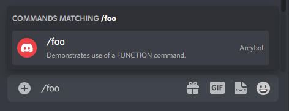

# Custom command

Custom command is the most powerful type of command offered by Arcybot. It allows you to create and execute a custom function with no limitations.

:::tip
The function which you want to execute via a custom commands must have the same name as the keyword for the command - for example, if you want to create a `help` command, its function must also be named `help`.
:::

### Custom command object

```ts
type CustomCommand = {
  /************************
   * CUSTOM COMMAND PROPS *
   * **********************/

  type: CommandType.FUNCTION, // indicated that the command is of a FUNCTION type

  /*************************
   * GENERIC COMMAND PROPS *
   * ***********************/
  
  keyword: string,            // keyword to use the command AND name of the function to be executed
  description: string,        // description of the command appearing in the slash command menu
  isDisabled: boolean,        // if set to true, command cannot be used
  isModOnly: boolean,         // if set to true, only users with ADMIN permissions can use it
  canUseInDm: boolean,        // if set to true, it can be used in private message
}
```

### Example

```ts title="index.ts"
import { Arcybot, CommandObject, DiscordInteraction } from 'arcybot';

// `foo` is a custom function to be executed upon using the `foo` command.
// It must have the same name as the keyword of the command.
const foo = async (interaction: DiscordInteraction): Promise<void> => {
	const date = new Date().toLocaleDateString();
	interaction.reply(`Current date is: ${date}`);
};

// `commandsObject` defining the custom `foo` command.
const commandsObject: CommandObject[] = [{
  type: CommandType.FUNCTION,
  keyword: 'foo',
  description: 'Demonstrates use of a FUNCTION command.',
  isDisabled: false,
  isModOnly: false,
  canUseInDm: true,
}]

// `commandsFunctions` argument must be an array of custom functions.
const commandsFunctions = [foo];

const bot = new Arcybot(commandsObject, commandsFunctions, CONFIG);

bot.start('Bot started!');
```




